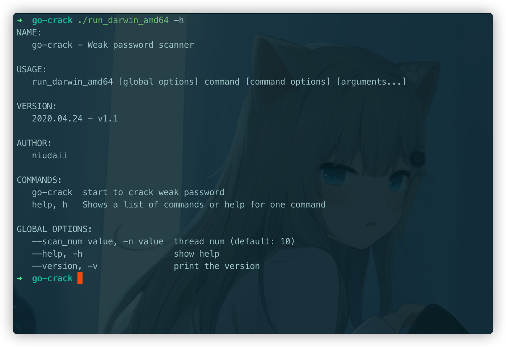
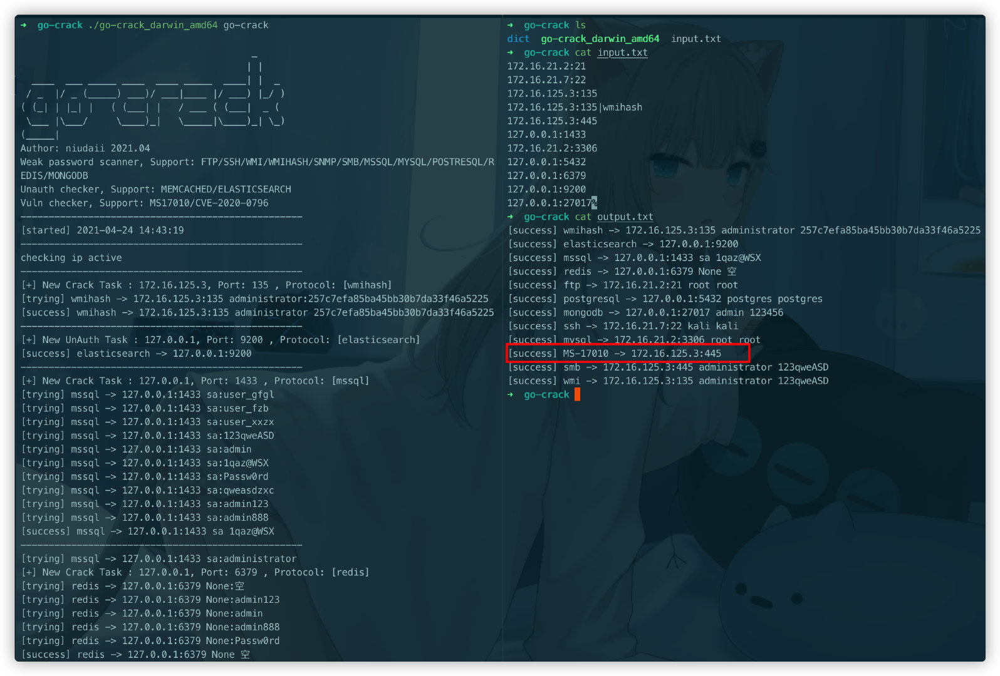

### 声明

仅限用于技术研究和获得正式授权的测试活动。

### 项目说明

我过去内网渗透中弱口令爆破一般使用超级弱口令(shack2)，但是存在部分问题。一是只支持windows系统+图形化界面，这就意味着要走代理或者 3389 连接上去使用；二是每次爆破都需要选择协议、ip 列表、字典文件，略显麻烦。

然后正好过年的时候看了《白帽子安全开发实战》，发现 go 语言真香，速度快+跨平台编译十分方便，因此花了点时间开发这个项目。

项目大致思路：只需要将端口扫描的结果放入 input.txt，即可启动go-crack，会根据端口对应默认服务，并加载对应服务的爆破字典进行爆破。

### 使用介绍



- 目前支持的类型（即端口对应的默认服务）

弱口令

```
		21: "ftp",
		22: "ssh",
		135: "wmi",
		161: "snmp",
		445: "smb",
		1433: "mssql",
		//1521: "oracle",
		3306: "mysql",
		3389: "rdp",
		5432: "postgresql",
		5985: "winrm",
		6379: "redis",
		27017: "mongodb",
```

漏洞（445 端口）

```
		MS17-010
		CVE-2020-0796
```

未授权

```
		9200: "elasticsearch",
		11211: "memcached",
```

web

```
		tomcat
		phpmyadmin
```

- 并发数

启动时我们需要控制的唯一参数就是并发数，`-n`指定即可，不指定的话默认为 10。

- 输入文件

固定输入文件名为：input.txt，每一行的格式为`ip:port`或者`ip:port|porotocol`，后面那种主要是针对修改了默认端口的服务。

135 端口默认对应 wmi 爆破，如果要 hash 爆破的话请指定porotocol 为 wmihash。

445 端口自动会检查 MS-17010和CVE-2020-0796。

tomcat和 phpmyadmin 必须指定模块，如`127.0.0.1:8080|tomcat`。

- 输出文件

固定输出文件名为：output.txt。

- 字典

字典放在/dict 下，根据爆破的服务加载对应的字典，可以自行根据实际情况更新字典。

### 使用演示

执行

```
./go-crack_darwin_amd64 go-crack
./go-crack_darwin_amd64 go-crack -n 15
```



可以看到除了弱口令之外，扫描出可能存在 MS-17010，可以进一步确认。

### 后续计划

- [x] rdp、oracle 协议爆破。
- [x] tomcat、weblogic 等web 弱口令爆破。
- [ ] 加入端口扫描+指纹识别（那么只需要输入 IP 即可一键大保健）。

### 更新记录

2021.04.20

- 第一版。

2021.04.24

- 增加了 wmi爆破和 wmihash 爆破模块。

2021.04.30

- mac实现 RDP、oracle，但是 oracle 多次爆破会锁定账户，因此移除。(windows 和 linux 看情况加，反正也没人 star🐶，建议下载`Release V1.1`因为支持多平台)。
- 增加了 tomcat 和 phpmyadmin爆破，weblogic 多次爆破会锁定账户，因此移除。(ps，`cve-2020-14882`)。
- 更新了一波大字典，也能在几分钟内完成。

2021.05.15

- 之前确实测试的较少，根据最近实战中遇到的一些问题，增加了一些可选参数

  ```
  -m "mssql" 指定要爆破的协议模块，可指定多个，比如 -m "mssql,mysql"
  -u "diyuser.txt" 加载自定义用户名字典，这时不加载爆破的服务对应的用户名字典，仍加载对应的密码字典
  -p "diypass.txt" 加载自定义密码字典,密码字典支持{user}格式，自动替换为当前爆破任务的用户名,比如{user}@2020，用户名为 admin时变为 admin@2020
  -i "input.txt" 输入文件
  -o "output.txt" 输出文件，默认为时间戳
  ```
  
- 修改字典

### 参考链接

https://github.com/netxfly/x-crack

https://github.com/k8gege/LadonGo

https://github.com/shadow1ng/fscan

https://github.com/zsdevX/DarkEye

---

喜欢的话给个Star吧，希望你不要不识抬举🐶。

