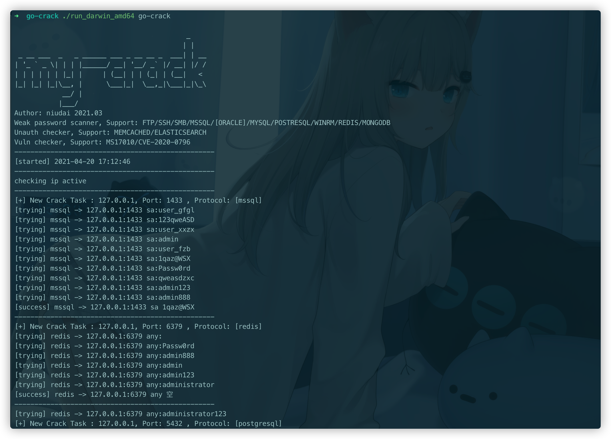

# go-crack

一、过去自己内网弱口令爆破一般使用超级弱口令(shack2)，因为不是命令行的形式，一般需要走代理。

二、go 语言编写，速度快+跨平台编译。

三、为了方便只需要将 ip:port 放入 iplist.txt 即可自动根据端口对应的默认服务加载默认的字典爆破，也可以`172.16.21.2:21|ssh`指定协议。

四、目前的缺陷是 wmi 和 rdp 和 oracle(只支持本地)不支持，之后打算加入一些 weblogic、tomcat 等弱口令爆破。

五、截图

六、参考链接：

https://github.com/netxfly/x-crack

https://github.com/k8gege/LadonGo

https://github.com/shadow1ng/fscan

